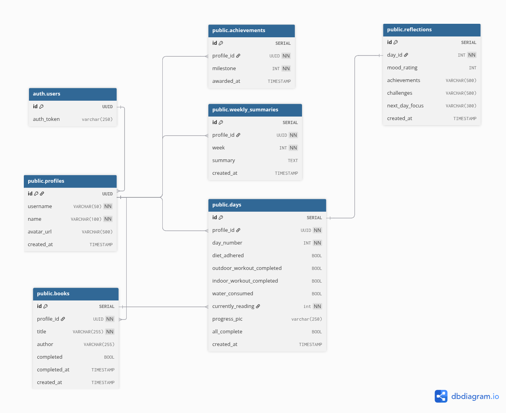

# 75 Hard AI Habit Tracker

A mobile app that helps users track their daily habits during the 75 Hard challenge and receive AI-generated motivational feedback on their weekly progress

[View Project Presentation](https://www.canva.com/design/DAHC4xi2_tU/otKEfyHXPk4Bz2FXZ4S4sA/edit?utm_content=DAHC4xi2_tU&utm_campaign=designshare&utm_medium=link2&utm_source=sharebutton)

[Research Document](./Planning/RESEARCH.md)

## Schema Diagram

[View interactive schema on dbdiagram.io](https://dbdiagram.io/d/69aae92aa3f0aa31e1123fb2)



## How to run sqlfluff

```bash
sqlfluff lint <file_path>
sqlfluff fix <file_path>
```
